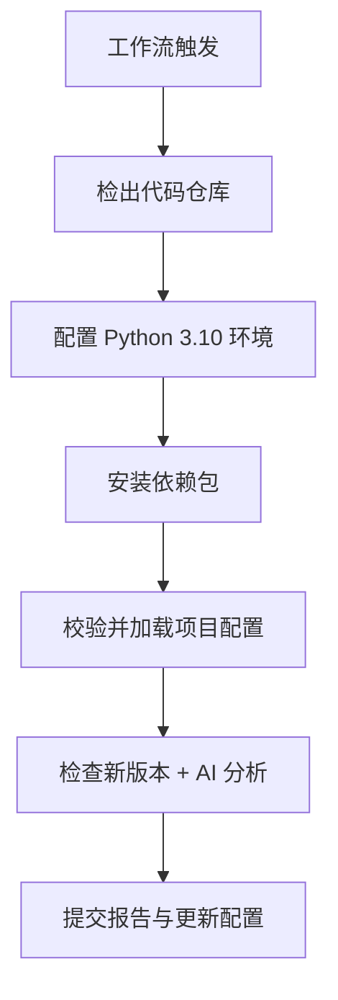

# 开源项目更新监控与分析 Projectinspector

## 概述
本 GitHub Action 旨在自动化监控指定开源项目的版本更新，并借助自定义 AI 模型对更新内容进行多维度分析，最终生成结构化的分析报告并提交至仓库。支持**定时执行**与**手动触发**，帮助团队及时掌握依赖项目的更新动态及潜在影响，降低因开源项目更新引发的系统兼容性、安全风险等问题。


## 核心功能
- **双触发机制**：默认每天中国时间凌晨 1 点（UTC 时间 17:00）定时执行，同时支持通过 GitHub 网页手动触发，兼顾周期性监控与紧急检查需求。
- **严格配置校验**：自动检测项目配置文件（`projects.json`）的存在性，同时验证其 JSON 格式有效性，避免因配置错误导致工作流失败。
- **多维度 AI 分析**：基于自定义 AI 模型，从功能变更、安全风险、稳定性与性能等 6 个核心维度，对开源项目更新进行专业评估。
- **自动化报告管理**：生成标准化 Markdown 格式分析报告，自动保存至仓库 `reports/` 目录，并提交报告及配置变更至 Git 仓库。
- **配置自动同步**：检测到项目新版本后，自动更新 `projects.json` 中的“上次检查版本”字段，避免重复分析已处理的版本。


## 工作原理
整个工作流运行在 `ubuntu-latest` 环境中，通过 7 个核心步骤实现开源项目的监控与分析，具体流程如下：



### 各步骤详细解析
#### 1. 工作流触发（on 配置）
- **定时触发**：通过 `cron: '0 17 * * *'` 定义，每天 UTC 时间 17:00（对应中国时间次日凌晨 1 点）自动执行，适配国内团队工作节奏。
- **手动触发**：通过 `workflow_dispatch` 配置，支持在 GitHub 仓库「Actions」页面点击“Run workflow”手动启动，灵活应对临时监控需求。

#### 2. 检出代码仓库（actions/checkout@v3）
- 功能：将当前 GitHub 仓库的代码完整拉取到工作流运行环境中。
- 关键配置：`persist-credentials: true`，保留 Git 凭据，确保后续步骤可正常提交代码变更。

#### 3. 设置 Python 环境（actions/setup-python@v4）
- 功能：安装并配置 Python 3.10 版本（脚本依赖该版本特性），为后续依赖安装和 Python 脚本执行提供基础环境。

#### 4. 安装依赖包
- 通过 `pip` 命令安装以下核心依赖，确保脚本正常运行：
  - `openai`：用于调用自定义 AI 模型接口，实现更新内容分析。
  - `python-dotenv`：环境变量管理工具（预留扩展能力，支持从 `.env` 文件加载配置）。
  - `requests`：HTTP 请求库，辅助实现 API 调用与数据获取。
  - `PyGithub`：GitHub 官方 API 客户端，用于获取开源项目的版本信息、CHANGELOG 文件等。
  - `python-dateutil`：日期解析与时区处理工具，确保分析报告中的时间信息准确（适配中国时区）。

#### 5. 校验并加载项目配置
- **配置校验**：
  1. 检查根目录是否存在 `projects.json`，若不存在则报错并终止工作流（提示“请先创建并配置该文件”）。
  2. 验证 `projects.json` 是否为有效 JSON 格式（通过 `jq` 工具校验），格式错误则报错终止。
  3. 自动安装 `jq` 工具（若环境未预装），用于 JSON 格式处理与配置内容提取。
- **配置加载**：将 `projects.json` 内容通过 `jq -c` 压缩后，写入环境变量 `PROJECTS_CONFIG`，供后续步骤调用。

#### 6. 检查新版本并执行 AI 分析（核心步骤）
- **初始化工具**：
  1. 通过 `GITHUB_TOKEN` 初始化 GitHub 客户端，用于访问开源项目仓库数据。
  2. 通过 `OPENAI_API_KEY` 和 `CUSTOM_MODEL_ENDPOINT` 初始化 AI 客户端，配置自定义模型接口（默认使用 `DeepSeek-V3` 模型）。
- **参数校验**：检查 `OPENAI_API_KEY` 和 `CUSTOM_MODEL_ENDPOINT` 是否存在，缺失则抛出异常并终止分析。
- **遍历项目处理**：对 `projects.json` 中配置的每个项目执行以下操作：
  1. **版本对比**：获取项目最新发布版本（通过 GitHub API），与 `last_checked_version` 对比，若无新版本则跳过该项目。
  2. **获取更新内容**：
     - 优先读取仓库根目录的 `CHANGELOG.md` 文件，若文件过大（超过 8000 字符），则截取最新版本相关内容（通过版本标题定位）。
     - 若 `CHANGELOG.md` 不存在，則使用项目最新发布的“发布说明”（`latest_release.body`）作为替代内容。
     - 若两者均不存在，则跳过该项目（提示“无法分析”）。
  3. **AI 分析调用**：
     - 构造分析提示词（基于预设模板，包含 6 个分析维度），填充项目名称、版本、更新内容等信息。
     - 调用自定义 AI 模型接口，设置 `temperature=0.3`（保证分析结果稳定性）、`max_tokens=5000`（确保报告内容完整）。
  4. **生成分析报告**：将 AI 返回的分析结果保存为 Markdown 文件，路径为 `reports/项目名_版本_日期.md`（如 `React_v18.3.0_20240520.md`）。
  5. **更新项目配置**：将当前项目的 `last_checked_version` 更新为最新版本，写入内存中的配置对象。
- **保存配置**：将更新后的项目配置重新写入 `projects.json` 文件，完成配置同步。

#### 7. 提交报告与更新配置
- **Git 配置**：设置全局 Git 用户名（`Qi`）和邮箱（`todayhill@gmail.com`），确保提交操作合法。
- **变更检测**：将 `reports/` 目录下的新报告和更新后的 `projects.json` 加入 Git 暂存区，通过 `git diff --quiet --staged` 检测是否有变更。
- **提交推送**：若存在变更，提交代码（提交信息包含当前日期）并推送到远程仓库；若无变更，则提示“没有新报告需要提交”。


## 使用指南

### 1. 前置准备
#### 1.1 仓库目录结构
需在 GitHub 仓库根目录创建以下文件/目录（部分由脚本自动生成）：
```
your-repo/
├── .github/
│   └── workflows/
│       └── project-monitor.yml  # 本 Action 脚本（文件名可自定义）
├── projects.json                # 项目配置文件（必填，手动创建）
└── reports/                     # 报告存储目录（脚本自动创建）
```

#### 1.2 配置 `projects.json`
`projects.json` 是监控项目的核心配置文件，格式为 JSON 数组，支持配置多个项目，示例如下：
```json
[
  {
    "name": "React",                // 自定义项目名称（用于报告标题）
    "github_repo": "facebook/react",// GitHub 仓库全称（格式：用户名/仓库名）
    "last_checked_version": "v18.2.0"// 上次检查的版本（初始值设为当前最新版本）
  },
  {
    "name": "Vue.js",
    "github_repo": "vuejs/vue",
    "last_checked_version": "v3.3.4"
  }
]
```
- **注意**：`github_repo` 必须准确（与 GitHub 仓库地址一致），`last_checked_version` 需与项目实际版本格式匹配（如带 `v` 前缀或纯数字）。

#### 1.3 设置仓库 Secrets
在 GitHub 仓库的「Settings」→「Secrets and variables」→「Actions」→「New repository secret」中，添加以下 2 个必要密钥：

| Secret 名称          | 说明                                                                 |
|----------------------|----------------------------------------------------------------------|
| `OPENAI_API_KEY`     | 访问自定义 AI 模型的 API 密钥（即使模型无需密钥，也需填写非空值，避免脚本报错）。 |
| `GITHUB_TOKEN`       | GitHub 自动生成的仓库令牌（无需手动创建，用于访问仓库、提交代码，脚本自动调用）。 |


### 2. 部署 Action 脚本
1. 在仓库的 `.github/workflows/` 目录下，创建 YAML 文件（如 `project-monitor.yml`）。
2. 将本 Action 脚本的完整内容复制到该 YAML 文件中，保存并提交至 GitHub 仓库。


### 3. 触发工作流
#### 方式 1：定时触发
无需手动操作，工作流会按照 `cron` 配置，每天中国时间凌晨 1 点自动运行。

#### 方式 2：手动触发
1. 进入 GitHub 仓库首页，点击顶部导航栏的「Actions」。
2. 在左侧“工作流”列表中，找到本 Action（名称为脚本中 `name` 字段的值：“开源项目更新监控与分析”）。
3. 点击“Run workflow”按钮，在弹出的窗口中直接点击“Run workflow”（无需额外参数），即可启动工作流。


### 4. 查看分析报告
工作流运行成功后，分析报告会自动保存至仓库的 `reports/` 目录下，文件名格式为：
`[项目名]_[版本号]_[日期].md`（如 `React_v18.3.0_20240520.md`）。

报告包含以下结构化模块，内容清晰且重点突出：
- **基本信息**：项目名称、仓库地址、版本号、分析日期。
- **总体评估**：更新影响评级（低/中/高）及核心理由。
- **关键风险提示**：3-5 个核心风险点（使用加粗、⚠️ 符号突出）。
- **详细分析**：6 个维度的具体评估（功能变更、安全风险、稳定性等）。
- **建议措施**：可操作的优化建议（按优先级排序）。
- **补充说明**：其他需要注意的特殊信息。


## 注意事项
1. **AI 模型适配**：脚本默认使用 `DeepSeek-V3` 模型，若需更换其他模型，需修改 `client.chat.completions.create` 中的 `model` 参数（需与自定义模型接口匹配）。
2. **CHANGELOG 依赖**：若监控的开源项目无 `CHANGELOG.md` 且无发布说明，脚本会跳过该项目的分析（可在工作流日志中查看具体提示）。
3. **API 额度限制**：需确保 `OPENAI_API_KEY` 对应的账号有足够的 API 调用额度，避免因额度不足导致 AI 分析失败（可在工作流日志的“检查新版本并分析”步骤中排查）。
4. **时区调整**：若需修改定时触发时间，需将目标时间换算为 UTC 时间后，更新 `on.schedule.cron` 表达式（格式：`分 时 日 月 周`）。例如：中国时间凌晨 2 点 = UTC 时间 18 点，Cron 表达式为 `0 18 * * *`。
5. **权限配置**：脚本需 `contents: write` 权限（已在 `jobs.monitor-projects.permissions` 中配置），用于提交报告和更新配置文件，请勿删除该权限配置（否则会导致提交失败）。


## 常见问题（FAQ）
### Q1：工作流运行报错“错误：projects.json不存在，请先创建并配置该文件”？
A1：需在仓库根目录手动创建 `projects.json` 文件，并按照「使用指南 - 配置 projects.json」中的格式，添加需要监控的开源项目信息。

### Q2：工作流显示“没有新报告需要提交”，但确认监控的项目有新版本？
A2：可能原因及排查步骤：
1. 检查 `projects.json` 中该项目的 `last_checked_version` 是否已更新为最新版本（若之前手动修改过，会导致脚本判定无更新）。
2. 查看工作流日志的“检查新版本并分析”步骤，确认是否因“CHANGELOG 不存在且无发布说明”导致分析跳过。
3. 确认 AI 模型调用是否成功（日志中是否有“调用自定义模型 API 进行分析”的后续输出，若报错需检查 `OPENAI_API_KEY` 和 `CUSTOM_MODEL_ENDPOINT` 是否正确）。

### Q3：如何修改分析报告的格式或分析维度？
A3：可修改脚本中 `analysis_prompt_template` 变量的内容：
- 调整 Markdown 格式：直接修改模板中的标题、列表结构等（如增加/删除模块、调整强调符号）。
- 调整分析维度：修改模板中“分析维度”部分的描述，以及对应的“详细分析”模块（需确保 AI 能理解新的维度要求，建议同步调整提示词中的系统角色描述）。

### Q4：工作流提交报告时报错“git push 失败”？
A4：排查步骤：
1. 确认 `persist-credentials: true` 配置是否存在（在 `actions/checkout` 步骤中），缺失该配置会导致 Git 凭据无效。
2. 检查 `GITHUB_TOKEN` 是否有仓库写入权限（默认情况下，GitHub 自动生成的 `GITHUB_TOKEN` 具备该权限，若手动创建令牌需确保勾选 `repo` 权限）。
3. 查看工作流日志中的“提交并推送报告”步骤，确认是否有“权限被拒绝”等具体错误信息（若有，需检查仓库 Secrets 中的 `GITHUB_TOKEN` 是否正确配置）。